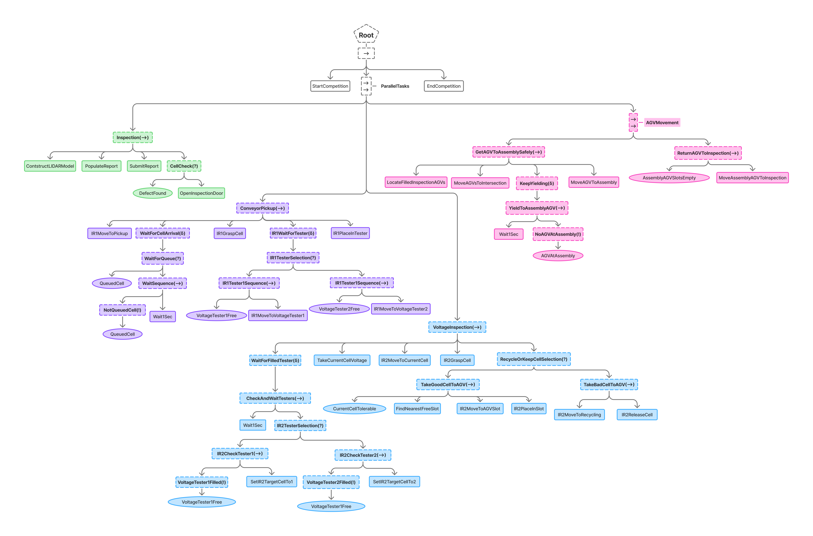

# NIST ARIAC 2025 Submission

[NIST ARIAC](https://pages.nist.gov/ARIAC_docs/en/latest/index.html) is a competition to test the ability of robots to perform complex manufacturing tasks in a dynamic environment.

## Task 1 - Inspection and Kit Building

Below is the behavior tree structure followed in my code, each color indicates a new step(s) being handled. The nodes will run in parallel as indicated by the roots.

### For Reference:
- Green is Step 1a - Physical Inspection
- Purple is Step 1b - Conveyor Pickup
- Blue is Step 1c & 1d - Voltage Inspection & AGV Placement
- Pink is Step 1e - Move AGV

  
 
[View on Figma](https://www.figma.com/board/FQbgSewBoVZuaahuNycCL8/NIST_ARIACMASTER?node-id=0-1&p=f&t=e7GGcnD3WUBGhm5T-0)
